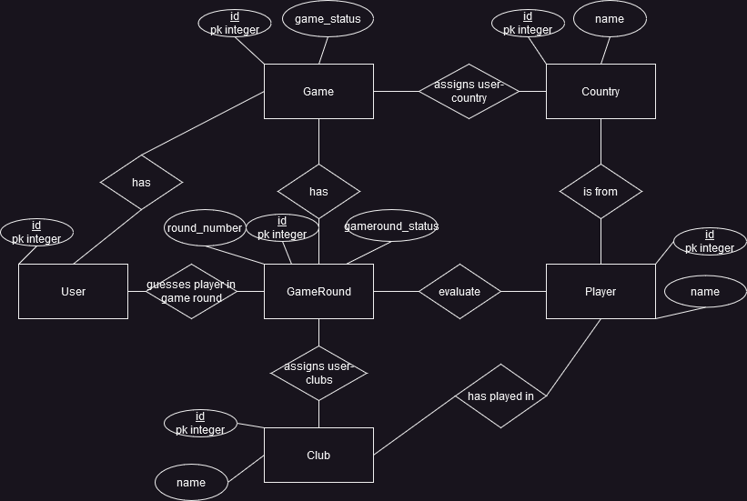

# Football Game

## E/R Diagram

## Initialization
Clone / download repository files.

In pgAdmin, create a database called 'game'.
Within the created database in pgAdmin, create a schema called 'game'.

(Optional) Create a virtual environment using the following command:

    python -m venv Game/Game/

(Optional) Enter Game/Game/ and activate the virtual environment using the OS/shell dependent command for utils/activate
    Using the bash shell:
        source Scripts/activate

    Using Windows cmd
        Scripts/activate.bat

Enter Game/Game/ if not already. Run the following command to install the necessary packages: (could be done in a virtual environment)

    pip install -r requirements.txt

The .env file should be as the following:

    SECRET_KEY=<secret_key>
    DB_USERNAME=postgres || <postgres_user_name>
    DB_PASSWORD=postgres || <postgres_user_password>
    DB_NAME=game || <postgres_db_name>

To initialize the database run the following commands.

    cd utils
    python init_db.py

Now everything has been set up. Returning to the game folder (using "cd .."), you can run the application using
    
    flask run

## Interaction with website and game rules
The design is very minimalistic, and should be straight forward. 

### Game rules
The purpose of the game, is that two users compete against eachother in a footballplayer guessing game.
It is a turn-based, sudden death game, with the first user, i.e. user 1 starting.
Both users are assigned a country at the start of the game. Each round, the users also get assigned a new club.
The users task is to guess a player that has history in the club (current or present), and is from their assigned country.
If you are having trouble guessing the correct player, please use 'players_careers.txt' as cheatsheet.

## Backend issues
A game is only set as completed when a new game is started. This could create problems: if the user opens another browser, they could keep playing a game, which should be completed.
If a game already exists, and the user goes back to home, they cannot reset the game by clicking start. They have to finish the game.

## Frontend issues
When a player is submitted, we do not clear the form.
Caused by our backend implementation, we do not have the chance of displaying which is the current user; not knowing this can be a bit confusing.

